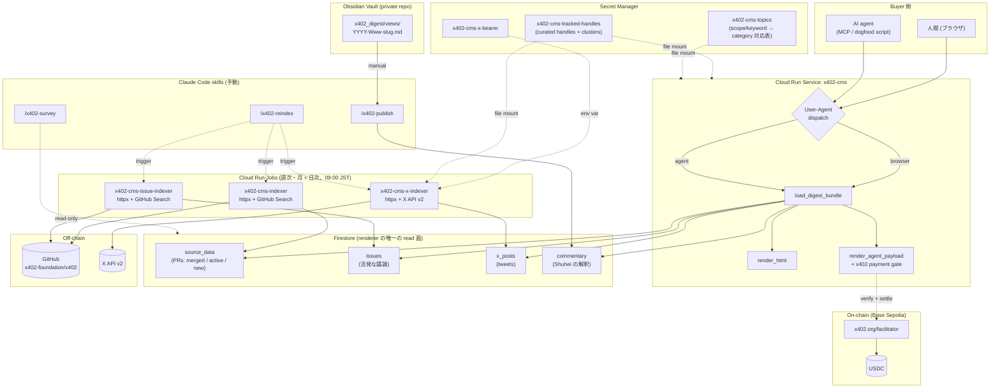
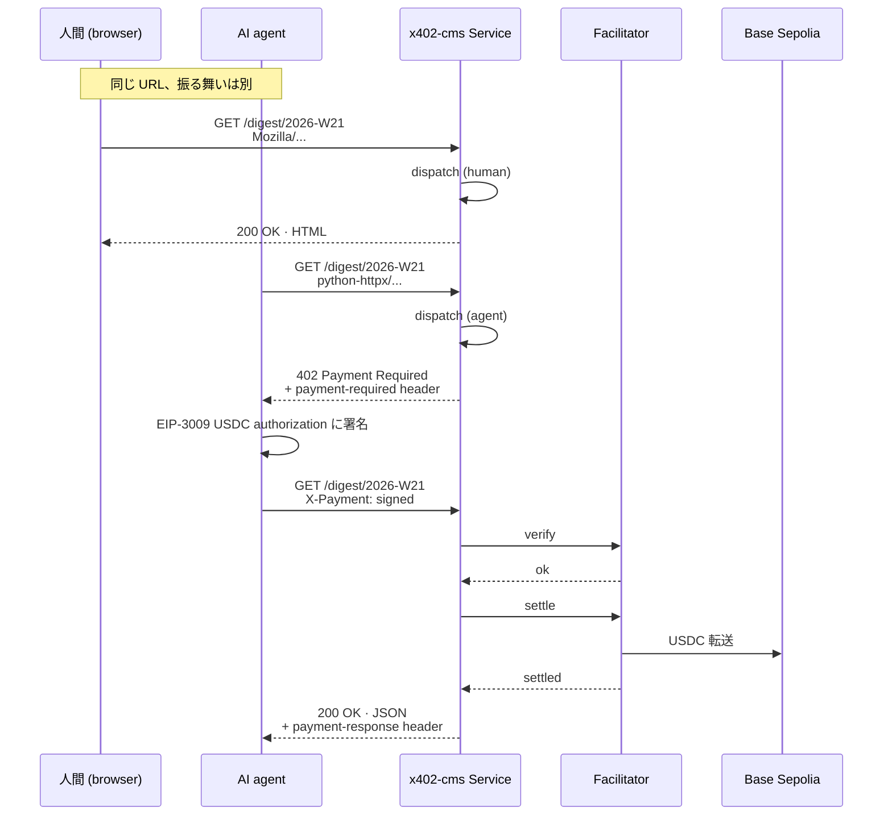
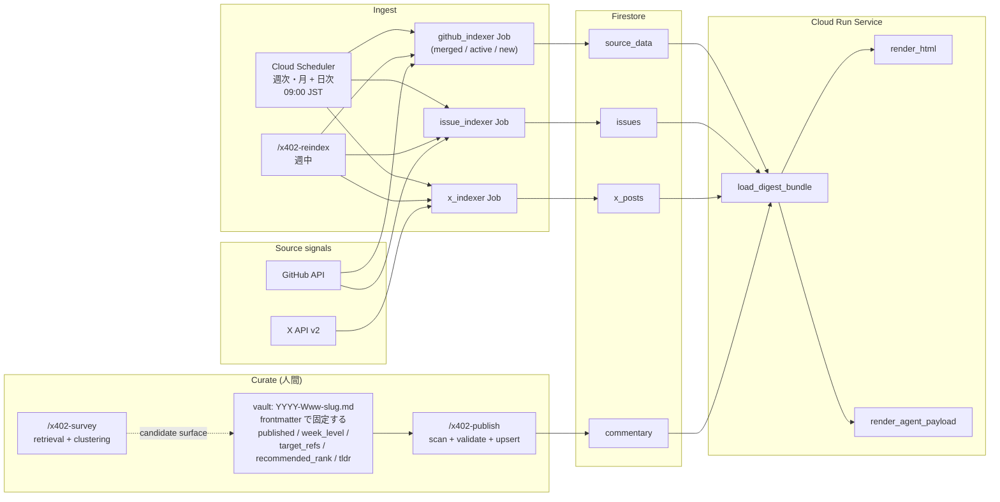
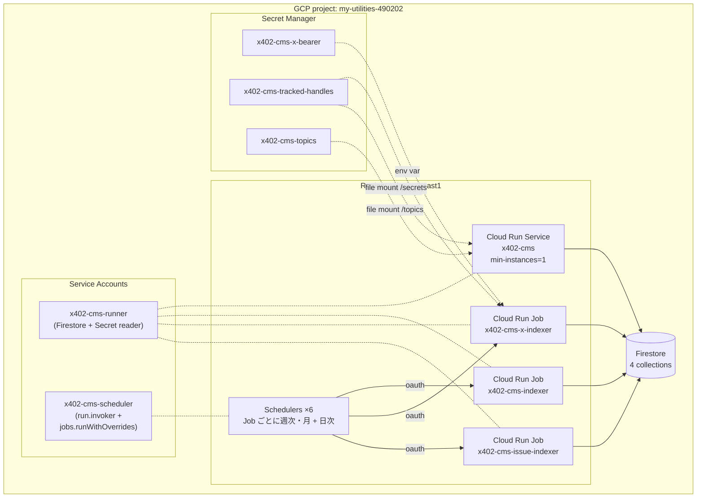
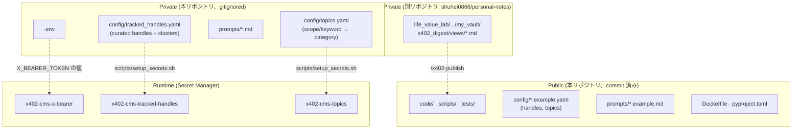

# x402-cms アーキテクチャ

`x402-cms` は **Agent-oriented CMS** のリファレンス実装である。同じ URL で
リクエスタに応じて 2 種類のレンダリングを返す: 人間 (ブラウザ) には無料
HTML、AI agent には HTTP 402 + x402 プロトコル経由で有料 JSON。

[English](architecture.md)

Phase 0〜4 が本番稼働中。Phase 5 (mainnet 化 + batch-settlement scheme への
切替) はロードマップに残っている。現状の決済は **Base Sepolia testnet の
USDC** を `x402.org/facilitator` 経由で扱う。人間向け view は情報設計を
一巡済み: ファーストビューのダッシュボード (This week at a glance)、
議論が熱い順のセクション構成、量の多い content の機械的な折りたたみ、
ページ内ナビゲーションを備える。

## 1. システム全体像



設計上の要点:

- **同じ URL を User-Agent で振り分け**。`code/dispatch.py` がブラウザ
  marker (Mozilla / Chrome / Safari / …) を小さなホワイトリストで判定し、
  それ以外はデフォルトで agent 経路に流す。
- **リクエスト時の read 面は Firestore に閉じる**。4 collection、間に
  cache を置かない。GitHub / X を叩くのは Job だけで (週次が先週を確定し、
  日次が `--current` で進行中の週を更新する)、Service は render 時に
  外部 API を呼ばない。
- **curation はコードではなくファイルが持つ**。Service と X indexer Job
  は同じ Secret Manager (`x402-cms-tracked-handles`) を読み、Service は
  加えて `x402-cms-topics` を mount する。cluster 分類、fetch handle
  集合、glance の topic 分布が curation ファイルとずれることはない。
- **人間向け view は逆ピラミッド + 機械的折りたたみ**。ファーストビューに
  ダッシュボード (誰が動いたか / 何が注目か / どの領域の話か) を置き、
  議論セクションは comments 数の多い順に並べ、閉じられた新規 PR と
  リプライは `<details>` に畳む。並べ替えと折りたたみの規則はすべて機械的
  (リプライか否か、open か closed か、comments 数、時系列) で、engagement
  指標 (likes) は意図的にソートに使わない。topic 分布は curated な
  `topics.yaml` への表引きであり、**対応表そのものが編集行為、renderer は
  数えるだけ**。
- **LLM は judgment の下流にのみ入る**。`/x402-survey` は retrieval +
  clustering まで。observation と hypothesis は常に Shuhei が手で先に
  書く (Phase 4 の設計原則)。

## 2. リクエストシーケンス (人間 vs agent)



## 3. データフロー



補足:

- vault 自体が private git repo (`shuhei0866/personal-notes`)。編集履歴は
  git が持ち、Firestore は片道の publish 先。
- `published: false` で unpublish (Firestore doc を削除して renderer から
  見えなくする)。`delete: true` は明示的な retract 用フラグで、storage 層の
  挙動は同じだが log 上の意図が異なる。
- 週内の `recommended_rank` 一意性は publish 時の invariant。衝突したら
  全 write 前に run を fail させるので、Firestore に rank=1 が同一週に
  2 件並ぶことはない。

## 4. デプロイトポロジー



- **Service と Jobs の使い分け**。Service は常時起動 (`min-instances=1`、
  cold start を回避)。Jobs は短命 (X indexer は 10〜20 秒で完走)。各 Job
  は 2 本の schedule を持つ: 週次・月曜の run が先週を確定し、日次の run
  が `--current` の args override で進行中の週を更新する。
- **2 つの SA、権限は狭く**。`x402-cms-runner` は `datastore.user` +
  対象 3 secret への `secretAccessor` のみ。`x402-cms-scheduler` は対象
  3 Jobs への `run.invoker` に加え、最小のカスタムロール
  (`run.jobs.runWithOverrides`) を持つ — 日次 trigger が args override を
  渡すには素の invoker では足りないためである。
- **token と curated file で mount スタイルが違う**。`X_BEARER_TOKEN` は
  文字列なので env var として mount。curated yaml は file mount で、
  Cloud Run は 1 つの mount ディレクトリに 1 secret しか置けないため、
  handles は `/secrets/tracked_handles.yaml`、topics は
  `/topics/topics.yaml` に分かれる (loader のコードは local dev と
  同じまま、path だけが違う)。

## 5. モジュールマップ

```
code/
├── schemas/                  {pr, issue, x_post, commentary}.py · Pydantic
├── utils/
│   ├── dates.py              parse_iso_week, previous/current_iso_week,
│   │                         resolve_target_week, week_of, shift_iso_week
│   └── firestore.py          build_client (inject > project > ADC)
├── indexers/
│   ├── github_indexer.py     多種別 PR indexer (merged / active / new)
│   ├── github_issue_indexer.py  活発 issue の indexer (issues collection)
│   ├── x_text_parser.py      parse_pr_references
│   └── x_indexer/            (5 ファイル package)
│       ├── _http.py          API client + tweet → XPost 正規化
│       ├── loader.py         tracked_handles.yaml (flat / clusters 両対応)
│       ├── writer.py         x_posts upserter
│       ├── orchestrator.py   週単位の resolve → fetch → write
│       └── __main__.py       CLI
├── renderers/
│   └── digest/
│       ├── readers.py        5 つの Firestore reader (議論系は
│       │                     comments 数の多い順で返す)
│       ├── bundle.py         DigestBundle, cross-refs, recommendations,
│       │                     JP cluster filter
│       ├── topics.py         curated な scope/keyword → category 表引き
│       ├── html.py           render_html: glance ダッシュボード、
│       │                     折りたたみ、セクション nav + 週リンク
│       └── agent_json.py     render_agent_payload
├── publish/
│   ├── vault_parser.py       frontmatter 解析 + Commentary 構築
│   └── publisher.py          scan + validate + tombstone + upsert
├── survey/
│   └── surveyor.py           /x402-survey のバックエンド (Markdown 出力)
├── server/
│   ├── main.py               FastAPI app + ServerConfig + handler
│   └── static/               vendor した pico.classless.min.css (MIT)
├── dispatch.py               User-Agent で human / agent を振り分け
└── observability.py          構造化 JSON アクセスログ

scripts/
├── deploy.sh                 Service デプロイ (handles + topics を mount)
├── deploy_job.sh             github_indexer Job
├── deploy_issue_job.sh       issue_indexer Job
├── deploy_x_job.sh           x_indexer Job (bearer + handles を mount)
├── setup_sa.sh               runtime SA
├── setup_secrets.sh          bearer + handles + topics (idempotent)
├── setup_scheduler.sh        GitHub indexer の週次 Scheduler
├── setup_issue_scheduler.sh  issue indexer の週次 Scheduler
├── setup_x_scheduler.sh      X indexer の週次 Scheduler
├── setup_daily_schedulers.sh 日次 --current trigger + カスタムロール
├── check_no_attribution.sh   pre-commit ガード (メタ記述の検出)
├── check_semantic.py         pre-commit ガード (LLM 層)
└── dogfood_payment_loop.py   buyer 側 smoke (Base Sepolia)
```

Claude Code 用スキル 3 本は本リポジトリ外、`~/.claude/skills/` 配下:

| skill            | 役割                                                    |
|------------------|---------------------------------------------------------|
| `/x402-reindex`  | indexer の週中手動再走                                  |
| `/x402-survey`   | 週内データの retrieval + clustering、judgment は入れない |
| `/x402-publish`  | vault → Firestore commentary、rank 衝突を fail-fast      |

## 6. Public / Private の分離



リポジトリは公開だが、curator の judgement レイヤは 3 つの private 面に
分かれている:

- **本リポジトリ内、gitignored**: curated handle list 本体、topic 対応表、
  working prompts、`.env`。commit 済みの `.example.yaml` / `.example.md`
  は、fresh clone が live X API に対して即座に動き topic 分布も描ける
  template を担う。
- **別リポジトリ**: vault。commentary draft と編集履歴はそこに住む。
- **Secret Manager**: 本番 X bearer token と 2 つの curated yaml。
  Service + Jobs が起動時に mount する。いずれの値も `--set-env-vars`
  には載せない (Cloud Audit Logs / Cloud Build log への漏洩を防ぐ)。
