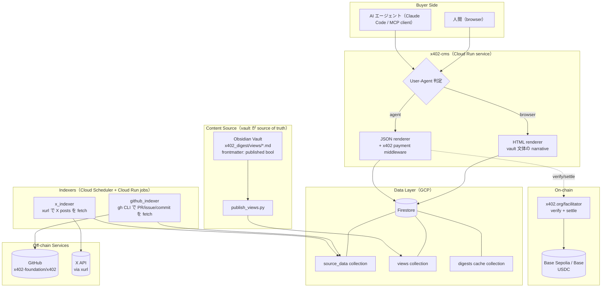
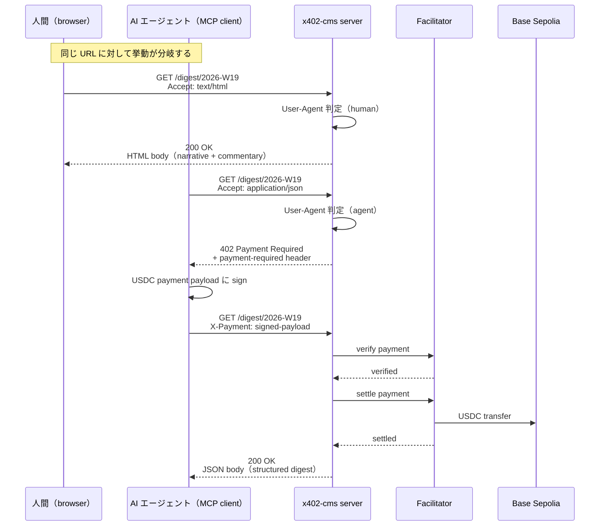
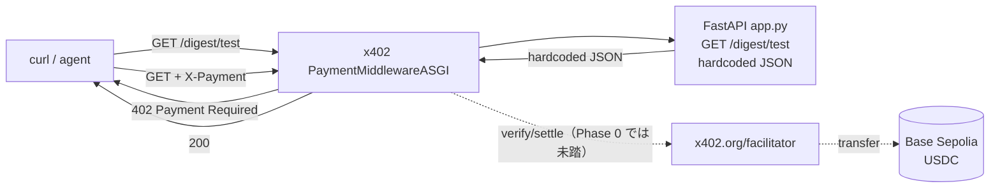
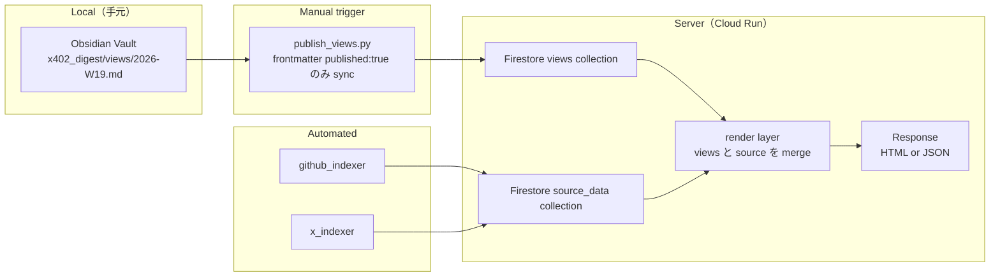
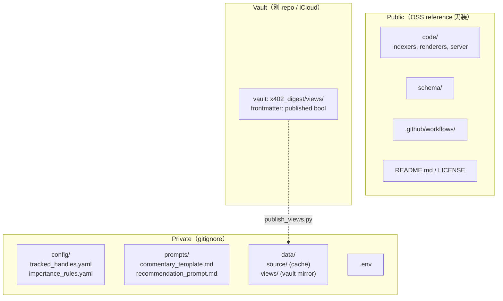

# x402-cms アーキテクチャ

`x402-cms` は **Agent-oriented CMS** の reference 実装。同じ URL で User-Agent によって render を分岐させる。人間（browser）は無料 HTML、AI エージェントは HTTP 402 → x402 payment → JSON、という構造。

[English](architecture.md)

## 1. システム全体像（target state）

Phase 1 以降を含む全体像。Phase 0 では `JSONRenderer` と `Facilitator` の往復だけが動く。

## 2. リクエストシーケンス（人間 vs エージェント）

同じ URL に対する 2 種類の挙動を時系列で示す。

## 3. Phase 0 の現状（minimal endpoint）

ここまで実装済みの範囲。content は hardcoded、scheme は `exact/evm`、network は Base Sepolia。

dotted の edge（`verify/settle` と `transfer`）は real payment が来た場合に通る経路を示すが、Phase 0 では実際にはまだ通っていない。curl での動作確認は 402 が返ることまで。

## 4. データの流れ（vault が draft、Firestore が published）

view content は人間が書く draft（vault）と server が読む published（Firestore）に分かれる。publish step が間に挟まる。

## 5. Public / Private の分離

repo は public、Shuhei 固有の judgement layer のみ gitignore する。

