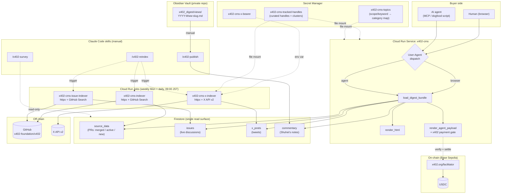
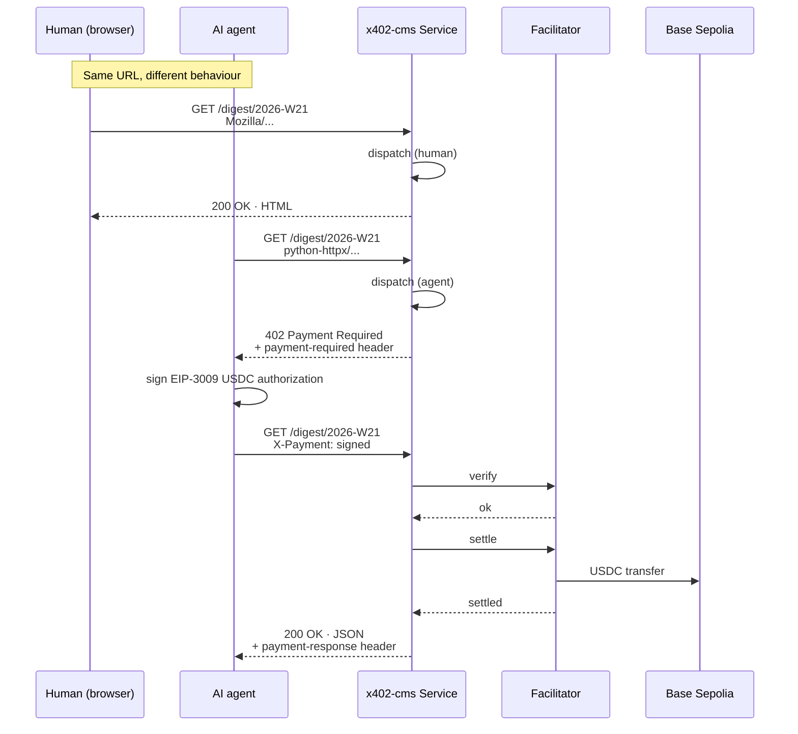
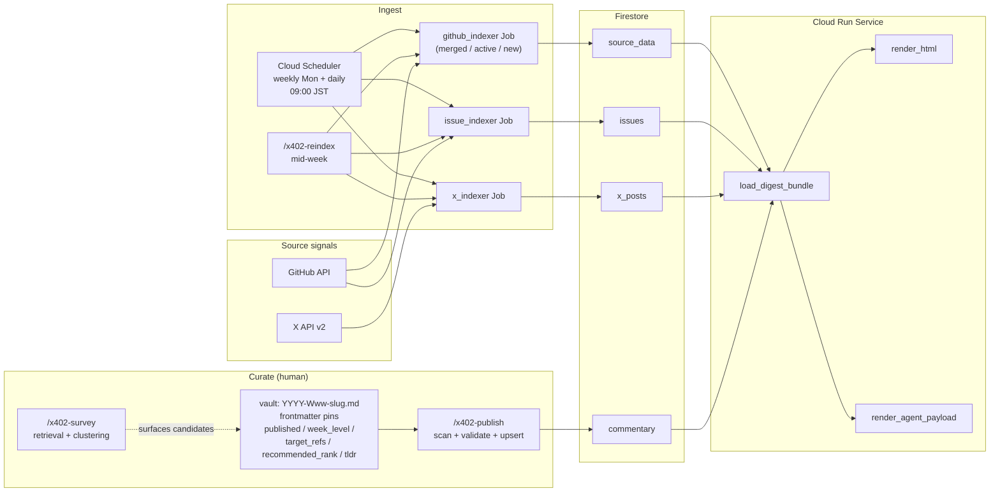
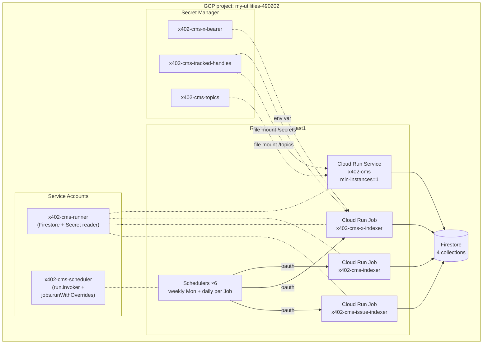
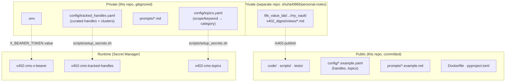

# x402-cms Architecture

`x402-cms` is a reference implementation of an **Agent-oriented CMS**.
The same URL serves two different renderings based on the requester:
a free HTML page for humans (browsers), and a paid JSON response for
AI agents via HTTP 402 + the x402 protocol.

[日本語版](architecture.ja.md)

Phases 0 through 4 are in production; Phase 5 (mainnet + the
batch-settlement scheme) is the remaining roadmap item. Payments
today run on **Base Sepolia testnet USDC** via `x402.org/facilitator`.
The human view has been through an information-design pass: a
first-view dashboard ("This week at a glance"), hottest-first section
ordering, mechanical folds for bulk content, and page navigation.

## 1. System overview



Key design choices:

- **Same URL, dispatched by User-Agent.** `code/dispatch.py` recognises
  a small whitelist of browser markers (Mozilla / Chrome / Safari / …);
  anything else takes the default agent path.
- **Firestore is the single read surface at request time.** Four
  collections, no caches in between. The Service does not call GitHub
  or X at render time — only the Jobs do, on their weekly + daily
  crons (weekly closes last week; daily refreshes the in-progress
  week with `--current`).
- **Curation is files, not code.** The Service and the X indexer Job
  read the same Secret Manager `x402-cms-tracked-handles`; the
  Service additionally mounts `x402-cms-topics`. Cluster groupings,
  fetch lists and the glance topic distribution can never disagree
  with the curated files.
- **The human view is an inverted pyramid with mechanical folds.**
  A first-view dashboard (who moved / what's hot / where the talk
  is) sits on top; discussion sections order most-discussed first;
  already-closed newcomers and reply tweets fold into `<details>`.
  Every ordering/folding rule is mechanical — reply-or-not,
  open-or-closed, comment counts, recency. Engagement metrics
  (likes) are deliberately not a sort key. The topic distribution is
  a lookup into the curated `topics.yaml`: the mapping table is the
  editorial act, the renderer only counts.
- **LLM stays downstream of judgment.** `/x402-survey` retrieves and
  clusters; the observation and hypothesis are always written by the
  human, by hand, first. (Phase 4 design principle.)

## 2. Request sequence (human vs agent)



## 3. Data flow



Notes:

- The vault is itself a private git repo (`shuhei0866/personal-notes`).
  Edit history is git, not Firestore — the publish path is one-way.
- `published: false` unpublishes (the doc is removed from Firestore so
  the renderer stops surfacing it); `delete: true` is the explicit
  retraction flag and behaves the same at the storage layer but logs
  the intent.
- `recommended_rank` uniqueness within a week is a publish-time
  invariant: a collision fails the whole run before any write, so
  Firestore never ends up with two rank-1 picks for the same week.

## 4. Deploy topology



- **Service vs Jobs.** Service is always-on (`min-instances=1`, cold
  start avoided). Jobs are short-lived (the X indexer typically
  finishes in ~10–20s). Each Job carries two schedules: the weekly
  Monday run closes last week, the daily run refreshes the
  in-progress week via a `--current` args override.
- **Two service accounts, narrow privileges.** `x402-cms-runner` has
  `datastore.user` + `secretAccessor` on the three specific secrets.
  `x402-cms-scheduler` holds `run.invoker` plus a minimal custom role
  (`run.jobs.runWithOverrides`) scoped to the three Jobs — the daily
  triggers pass an args override, which the plain invoker role does
  not cover.
- **Token vs curated-file mount style.** `X_BEARER_TOKEN` mounts as
  an environment variable (a string). The curated yamls mount as
  files, and Cloud Run allows one secret per mount directory: handles
  at `/secrets/tracked_handles.yaml`, topics at `/topics/topics.yaml`.
  The loader code is unchanged from the local-dev case — only the
  paths differ.

## 5. Module map

```
code/
├── schemas/                  {pr, issue, x_post, commentary}.py · Pydantic
├── utils/
│   ├── dates.py              parse_iso_week, previous/current_iso_week,
│   │                         resolve_target_week, week_of, shift_iso_week
│   └── firestore.py          build_client (inject > project > ADC)
├── indexers/
│   ├── github_indexer.py     multi-kind PR indexer (merged / active / new)
│   ├── github_issue_indexer.py  active-issue indexer (issues collection)
│   ├── x_text_parser.py      parse_pr_references
│   └── x_indexer/            (5-file package)
│       ├── _http.py          API client + tweet → XPost normaliser
│       ├── loader.py         tracked_handles.yaml (flat or clusters)
│       ├── writer.py         x_posts upserter
│       ├── orchestrator.py   per-week resolve → fetch → write
│       └── __main__.py       CLI
├── renderers/
│   └── digest/
│       ├── readers.py        5 Firestore readers (discussion reads sort
│       │                     most-discussed first)
│       ├── bundle.py         DigestBundle, cross-refs, recommendations,
│       │                     JP-cluster filter
│       ├── topics.py         curated scope/keyword → category lookup
│       ├── html.py           render_html: glance dashboard, folds,
│       │                     section nav + week links
│       └── agent_json.py     render_agent_payload
├── publish/
│   ├── vault_parser.py       frontmatter + Commentary build
│   └── publisher.py          scan + validate + tombstone + upsert
├── survey/
│   └── surveyor.py           /x402-survey backend (Markdown out)
├── server/
│   ├── main.py               FastAPI app + ServerConfig + handler
│   └── static/               vendored pico.classless.min.css (MIT)
├── dispatch.py               human/agent route on User-Agent
└── observability.py          structured JSON access log

scripts/
├── deploy.sh                 Service deploy (mounts handles + topics)
├── deploy_job.sh             github_indexer Job
├── deploy_issue_job.sh       issue_indexer Job
├── deploy_x_job.sh           x_indexer Job (mounts bearer + handles)
├── setup_sa.sh               runtime SA
├── setup_secrets.sh          bearer + handles + topics (idempotent)
├── setup_scheduler.sh        GitHub indexer weekly Scheduler
├── setup_issue_scheduler.sh  issue indexer weekly Scheduler
├── setup_x_scheduler.sh      X indexer weekly Scheduler
├── setup_daily_schedulers.sh daily --current triggers + custom role
├── check_no_attribution.sh   pre-commit guard (meta-attribution)
├── check_semantic.py         pre-commit guard (LLM layer)
└── dogfood_payment_loop.py   buyer-side smoke (Base Sepolia)
```

Three Claude Code skills live outside this repo, under
`~/.claude/skills/`:

| skill            | role                                                    |
|------------------|---------------------------------------------------------|
| `/x402-reindex`  | manual mid-week indexer trigger                         |
| `/x402-survey`   | retrieve + cluster a week's data; no judgment           |
| `/x402-publish`  | vault → Firestore commentary, with rank-collision check |

## 6. Public / private separation



The repository is public, but the curator's judgement layer is split
across three private surfaces:

- **In this repo, gitignored** — the real curated handle list, the
  topic mapping, the working prompts, `.env`. The committed
  `.example.yaml` / `.example.md` counterparts ship working templates
  so a fresh clone resolves against the live X API and renders a
  topic distribution on day one.
- **In a separate private repo** — the vault. Commentary drafts and
  edit history live there, not in Firestore.
- **In Secret Manager** — the production X bearer token and the two
  curated yamls. The Service + Jobs mount these at runtime; no value
  is ever in a `--set-env-vars` flag (which would leak into Cloud
  Audit Logs / Cloud Build logs).
