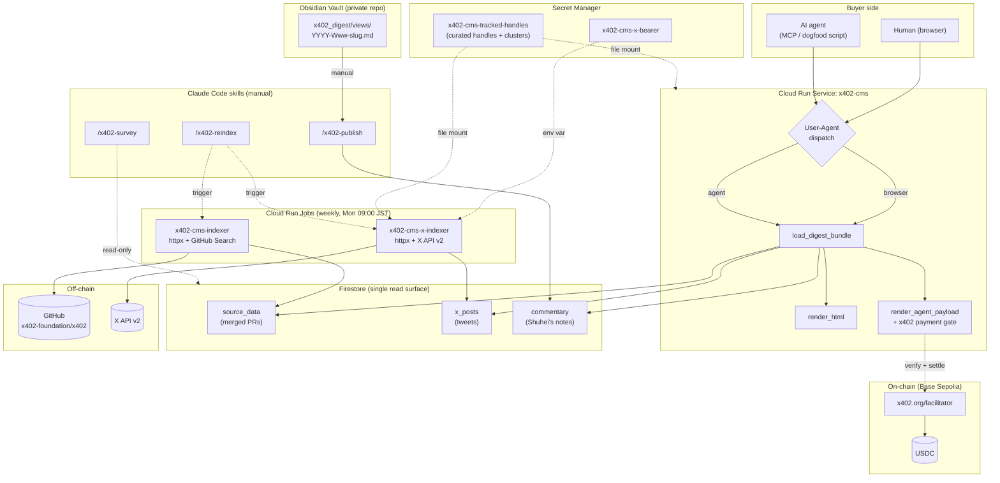
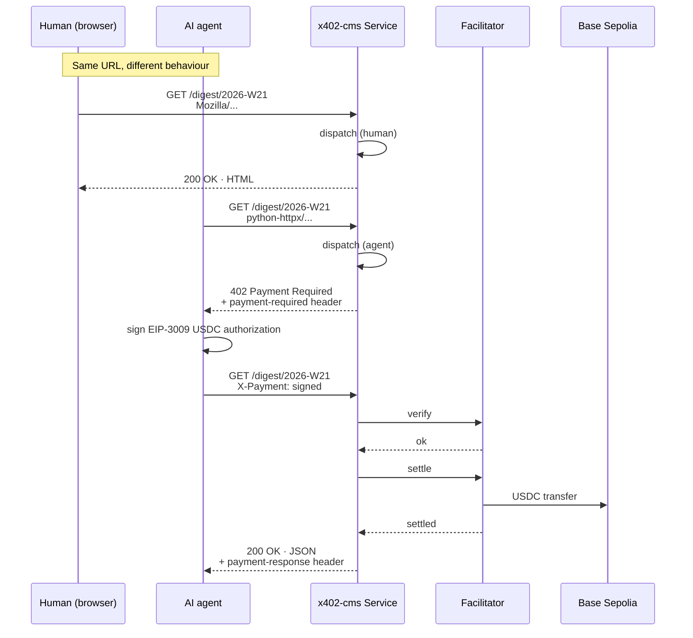
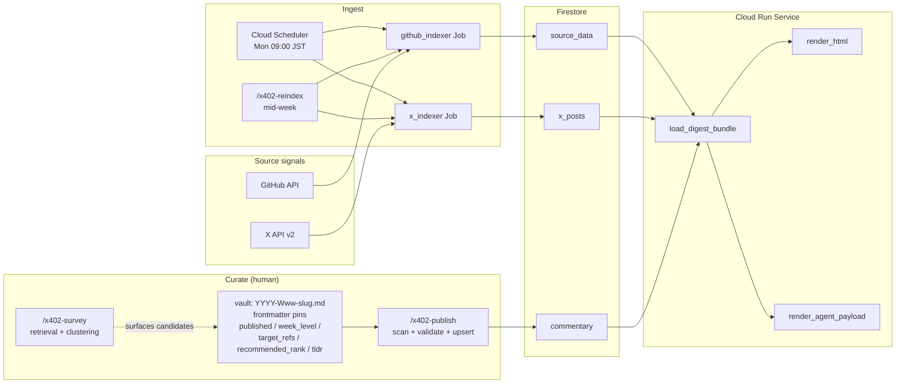
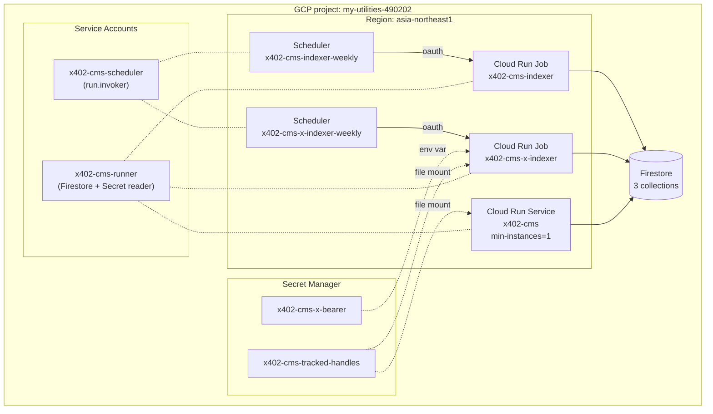
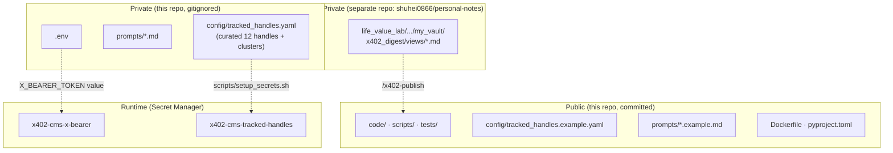

# x402-cms Architecture

`x402-cms` is a reference implementation of an **Agent-oriented CMS**.
The same URL serves two different renderings based on the requester:
a free HTML page for humans (browsers), and a paid JSON response for
AI agents via HTTP 402 + the x402 protocol.

[日本語版](architecture.ja.md)

Phases 0 through 4 are in production; Phase 5 (mainnet + the
batch-settlement scheme) is the remaining roadmap item. Payments
today run on **Base Sepolia testnet USDC** via `x402.org/facilitator`.

## 1. System overview



Key design choices:

- **Same URL, dispatched by User-Agent.** `code/dispatch.py` recognises
  a small whitelist of browser markers (Mozilla / Chrome / Safari / …);
  anything else takes the default agent path.
- **Firestore is the single read surface at request time.** Three
  collections, no caches in between. The Service does not call GitHub
  or X at render time — only the Jobs do, on the weekly cron.
- **Curation is one file, mounted in two places.** Both the Service
  and the X indexer Job read the same Secret Manager
  `x402-cms-tracked-handles` at `/secrets/tracked_handles.yaml`, so
  the renderer's cluster groupings and the indexer's fetch list can
  never disagree.
- **LLM stays downstream of judgment.** `/x402-survey` retrieves and
  clusters; the observation and hypothesis are always written by the
  human, by hand, first. (Phase 4 design principle.)

## 2. Request sequence (human vs agent)



## 3. Data flow



Notes:

- The vault is itself a private git repo (`shuhei0866/personal-notes`).
  Edit history is git, not Firestore — the publish path is one-way.
- `published: false` unpublishes (the doc is removed from Firestore so
  the renderer stops surfacing it); `delete: true` is the explicit
  retraction flag and behaves the same at the storage layer but logs
  the intent.
- `recommended_rank` uniqueness within a week is a publish-time
  invariant: a collision fails the whole run before any write, so
  Firestore never ends up with two rank-1 picks for the same week.

## 4. Deploy topology



- **Service vs Jobs.** Service is always-on (`min-instances=1`, cold
  start avoided). Jobs are short-lived (the X indexer typically
  finishes in ~10–20s).
- **Two service accounts, narrow privileges.** `x402-cms-runner` has
  `datastore.user` + `secretAccessor` on the two specific secrets.
  `x402-cms-scheduler` has `run.invoker` only on the two Jobs (not
  project-wide).
- **Token vs handles mount style.** `X_BEARER_TOKEN` mounts as an
  environment variable (a string). The handles yaml mounts as a file
  (a structured config) at `/secrets/tracked_handles.yaml`, and both
  the Service and the X Job point `--handles-config` at that path so
  the loader code is unchanged from the local-dev case.

## 5. Module map

Post-refactor (2026-05-27).

```
code/
├── schemas/                  {pr, x_post, commentary}.py · Pydantic models
├── utils/
│   ├── dates.py              parse_iso_week, previous_iso_week, week_of
│   └── firestore.py          build_client (inject > project > ADC)
├── indexers/
│   ├── github_indexer.py     httpx + GitHub Search API
│   ├── x_text_parser.py      parse_pr_references
│   └── x_indexer/            (5-file package, was a 424-line monolith)
│       ├── _http.py          API client + tweet → XPost normaliser
│       ├── loader.py         tracked_handles.yaml (flat or clusters)
│       ├── writer.py         x_posts upserter
│       ├── orchestrator.py   per-week resolve → fetch → write
│       └── __main__.py       CLI
├── renderers/
│   └── digest/               (4-file package, was a 428-line monolith)
│       ├── readers.py        3 Firestore readers
│       ├── bundle.py         DigestBundle, cross-refs, recommendations,
│       │                     JP-cluster filter
│       ├── html.py           render_html
│       └── agent_json.py     render_agent_payload
├── publish/
│   ├── vault_parser.py       frontmatter + Commentary build
│   └── publisher.py          scan + validate + tombstone + upsert
├── survey/
│   └── surveyor.py           /x402-survey backend (Markdown out)
├── server/
│   └── main.py               FastAPI app + ServerConfig + handler
├── dispatch.py               human/agent route on User-Agent
└── observability.py          structured JSON access log

scripts/
├── deploy.sh                 Service deploy (mounts handles secret)
├── deploy_job.sh             github_indexer Job
├── deploy_x_job.sh           x_indexer Job (mounts both secrets)
├── setup_sa.sh               runtime SA
├── setup_secrets.sh          bearer + handles secrets (idempotent)
├── setup_scheduler.sh        GitHub indexer Scheduler
├── setup_x_scheduler.sh      X indexer Scheduler
└── dogfood_payment_loop.py   buyer-side smoke (Base Sepolia)
```

Three Claude Code skills live outside this repo, under
`~/.claude/skills/`:

| skill            | role                                                    |
|------------------|---------------------------------------------------------|
| `/x402-reindex`  | manual mid-week indexer trigger                         |
| `/x402-survey`   | retrieve + cluster a week's data; no judgment           |
| `/x402-publish`  | vault → Firestore commentary, with rank-collision check |

## 6. Public / private separation



The repository is public, but the curator's judgement layer is split
across three private surfaces:

- **In this repo, gitignored** — the real curated handle list, the
  working prompts, `.env`. The committed `.example.yaml` /
  `.example.md` counterparts ship a working template so a fresh clone
  resolves against the live X API on day one.
- **In a separate private repo** — the vault. Commentary drafts and
  edit history live there, not in Firestore.
- **In Secret Manager** — the production X bearer token and the
  curated handle yaml. The Service + Job mount these at runtime;
  neither value is ever in a `--set-env-vars` flag (which would leak
  into Cloud Audit Logs / Cloud Build logs).
