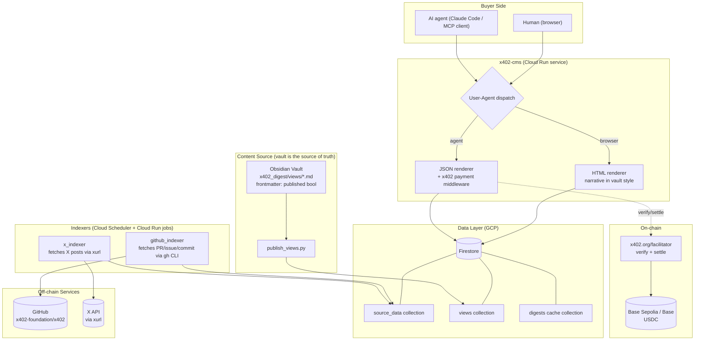
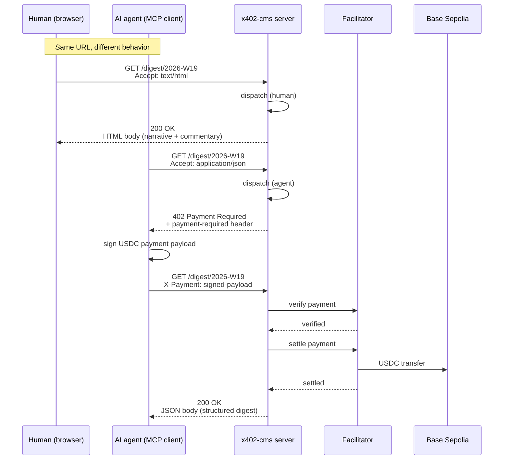
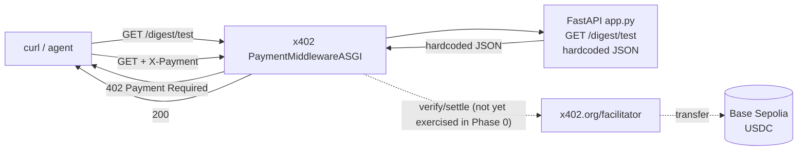
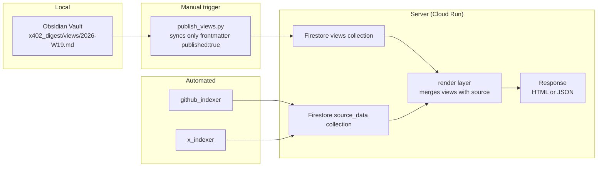
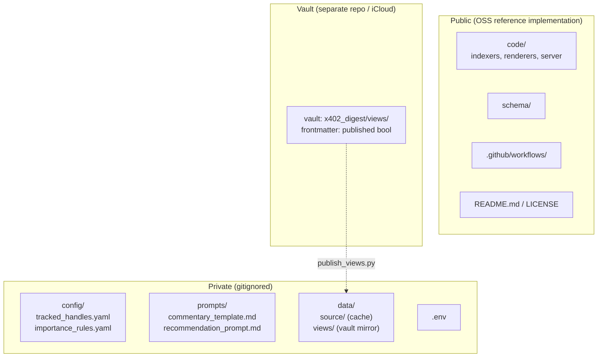

# x402-cms Architecture

`x402-cms` is a reference implementation of an **Agent-oriented CMS**. It serves the same URL with two different renderings based on the requester: a free HTML page for humans (browsers), and a paid JSON response for AI agents via HTTP 402 + the x402 protocol.

[日本語版](architecture.ja.md)

## 1. System overview (target state)

The full picture once Phase 1+ is in place. In Phase 0, only the `JSONRenderer` and `Facilitator` round-trip is wired up.

## 2. Request sequence (human vs agent)

The two behaviors at the same URL, shown over time.

## 3. Phase 0 (minimal endpoint, currently working)

What the repository runs today. Content is hardcoded; scheme is `exact/evm`; network is Base Sepolia.

The dotted edges (`verify/settle`, `transfer`) show the path that real payments would take but are not yet exercised in Phase 0 — the local curl test only verifies the 402 response.

## 4. Data flow (vault drafts, Firestore publishes)

View content is split between drafts written by humans (vault) and the published copy the server reads (Firestore). A publish step sits between them.

## 5. Public / private separation

The repository is public, but the curator's judgement layer is gitignored.

